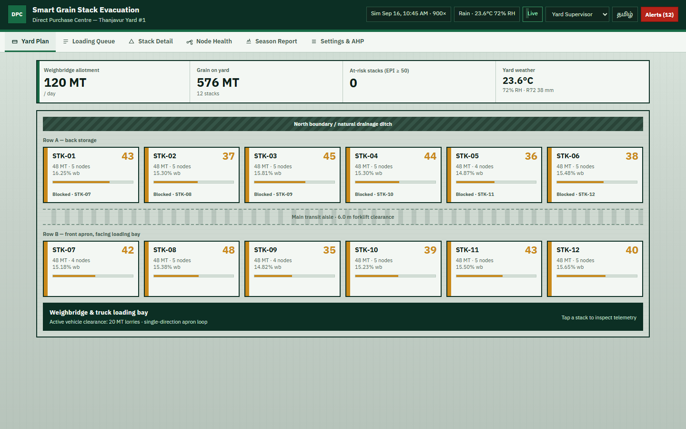
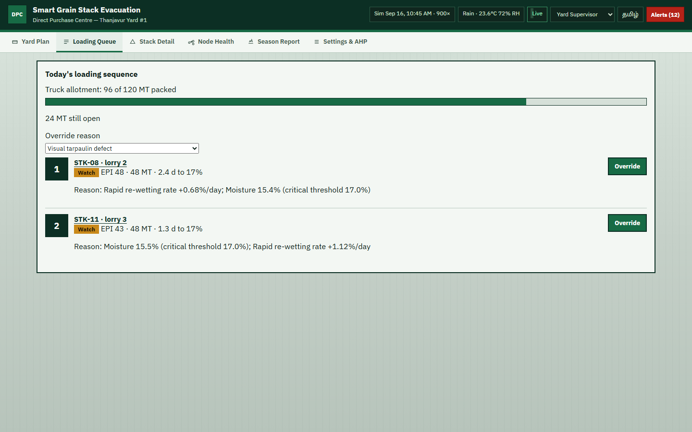
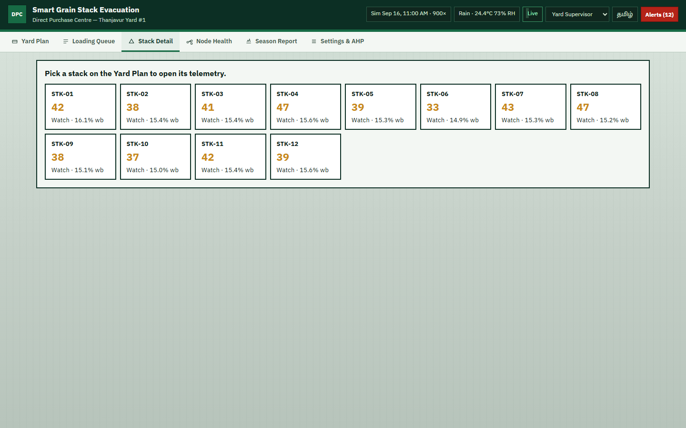
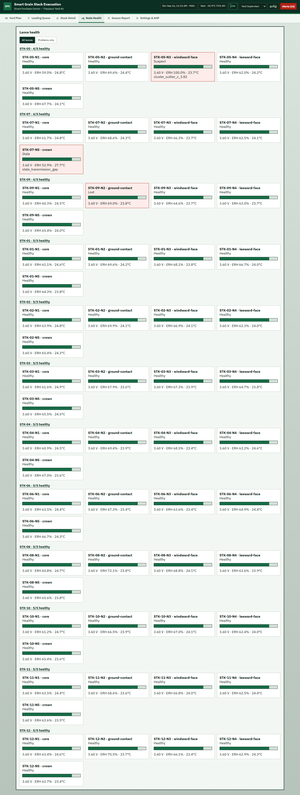
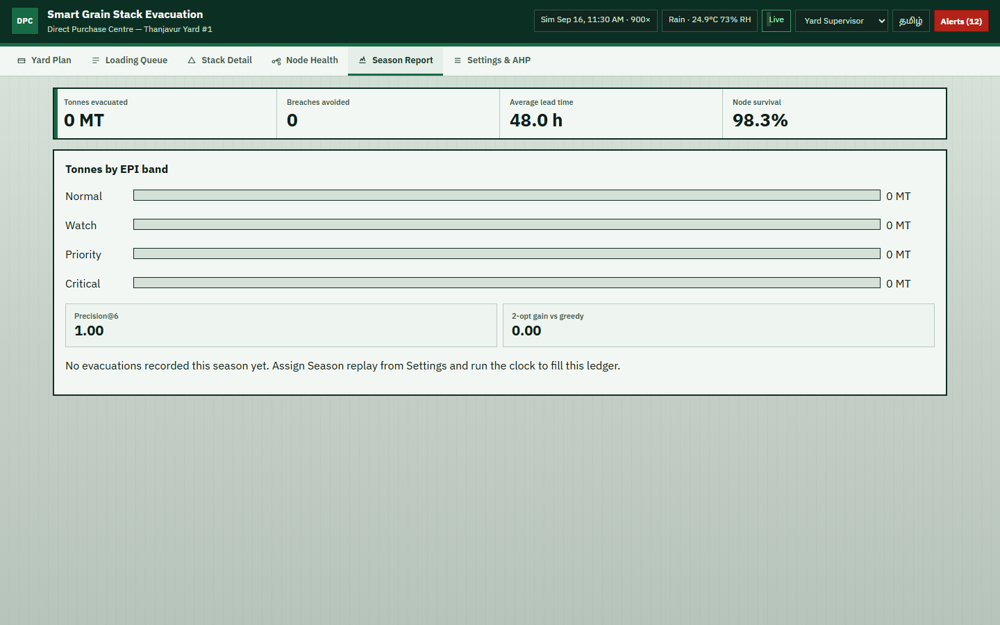
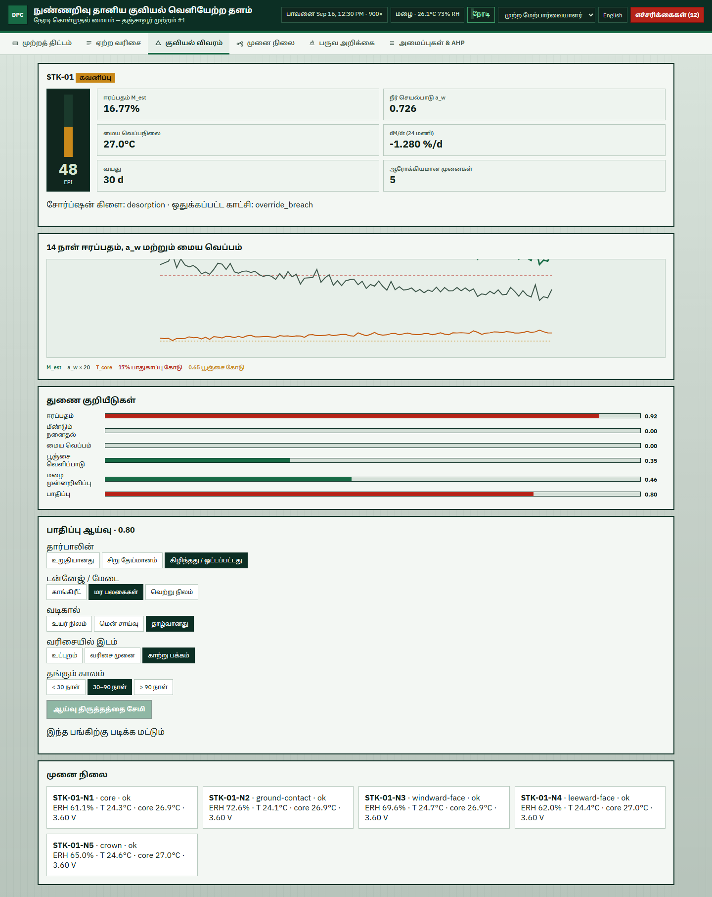

# 🌾 GrainEvac Platform — Smart Grain Stack Evacuation Platform

[](https://www.python.org/)
[](https://fastapi.tiangolo.com/)
[](https://react.dev/)
[](https://www.typescriptlang.org/)
[](https://vitejs.dev/)
[%20%7C%20Vitest%20(9%2F9)-success)](backend/tests)
[-green.svg)](LICENSE)

> **A physics-informed, standalone software implementation of the Smart Grain Stack Evacuation Platform for open-air agricultural procurement yards (Direct Purchase Centres — DPCs) across Tamil Nadu.**

---

## 🌾 The Agricultural Challenge

During harvesting seasons across the **Cauvery delta (Thanjavur, Tiruvarur, Nagapattinam)** and agrarian belts across India, millions of bags of freshly harvested paddy arrive at open-air **Direct Purchase Centres (DPCs)**. Stored outdoors in temporary stacks under tarpaulins while awaiting transport to state warehouses and rice mills, these grains face severe risks:

- **Flash Monsoon Rains & High Humidity:** Rapid boundary wetting can elevate moisture above critical fungal thresholds within hours.
- **Microbial Respiration & Biological Self-Heating:** Damp grain triggers rapid fungal colony proliferation (*Aspergillus*, *Penicillium*), initiating self-heating hotspots ($> 42^\circ\text{C}$) that destroy seed viability and produce carcinogenic aflatoxins.
- **Physical Yard Bottlenecks & Truck Shortages:** Yard layouts have narrow aisles where front stacks physically block inner stacks. Daily truck quotas are strictly limited, making ad-hoc evacuation dispatch inefficient.

**GrainEvac solves this challenge without requiring physical hardware.** Every physical sensor lance and LoRa mesh node is modeled by a **physically-honest synthetic telemetry generator** that simulates forward sorption thermodynamics, moisture diffusion lags, biological respiration, and sensor faults. Downstream modules ingest, filter, infer, score, and optimize evacuations exactly as if connected to live field sensors.

---

## 🏛️ System Architecture

The platform is structured into four decoupled, industrial-grade modules:

```
┌─────────────────────────────────────────────────────────────────────────────────────────────────────────┐
│                                         GRAINEVAC PLATFORM                                              │
└─────────────────────────────────────────────────────────────────────────────────────────────────────────┘
        │
        ▼
┌─────────────────────────┐      ┌──────────────────────────┐      ┌───────────────────────────┐
│ MODULE 1                │      │ MODULE 2                 │      │ MODULE 3                  │
│ Synthetic Telemetry     │ ───▶ │ Gateway Ingestion &     │ ───▶ │ EPI Engine & Dispatch     │
│ Generator               │      │ State Reconstruction     │      │ Optimizer                 │
│ • Chung–Pfost sorption  │      │ • Grid time-alignment    │      │ • 6 Physical Sub-indices  │
│ • Diffusion lags        │      │ • 5-stage fault screen   │      │ • 0–100 Evacuation Index  │
│ • Biological hotspot    │      │ • Isotherm inversion     │      │ • Hard safety overrides   │
│ • 10 Replay scenarios   │      │ • Mould Risk (MRA)       │      │ • AHP weight elicitation  │
│ • Weather synthesizer   │      │ • Theil–Sen slope        │      │ • Precedence 2-opt DAG    │
└─────────────────────────┘      └──────────────────────────┘      └───────────────────────────┘
                                                                                 │
                                                                                 ▼
                                                                   ┌───────────────────────────┐
                                                                   │ MODULE 4                  │
                                                                   │ Sunlight Outdoor UI       │
                                                                   │ • 6 High-contrast screens │
                                                                   │ • Tamil / English switch  │
                                                                   │ • Alert ladder & SMS      │
                                                                   │ • Offline cache (Indexed) │
                                                                   └───────────────────────────┘
```

### Module Breakdown
1. **Module 1: Synthetic Telemetry Generator ("The Swarm that Doesn't Exist")**
   - Implements forward **Modified Chung–Pfost sorption thermodynamics** to simulate interstitial relative humidity ($RH$) and temperature ($T$) across multiple depths (core, mid, boundary, base).
   - Simulates physical moisture diffusion lags ($\tau = 2\text{--}4\text{h}$), ambient diurnal cycles, sensor noise, jittered timestamps ($\pm 0\text{--}90\text{s}$), and 10 scripted scenarios.
2. **Module 2: Gateway Ingestion & State Reconstruction ("The Gateway")**
   - 15-minute grid time-alignment.
   - **5-stage fault screening:** range plausibility check, zero-variance stuck-at freeze detector, rate-of-change outlier detection, and intra-stack robust median z-scores.
   - Closed-form **Modified Chung–Pfost isotherm inversion** with sorption branch hysteresis (adsorption vs. desorption) to infer dry-basis and wet-basis grain moisture ($M_{est}$).
   - **Mould Risk Accumulator (MRA):** 14-day numerical exposure integral tracking cumulative biological spoilage potential above safe water activity ($a_w \ge 0.70$).
   - **Theil–Sen robust linear regression** over trailing 24 hours to estimate rate of moisture change ($dM/dt$) immune to transient condensation spikes.
3. **Module 3: EPI Engine & Dispatch Optimizer ("The Brain")**
   - Synthesizes 6 normalized physical sub-indices:
     - Moisture Risk ($s_M$)
     - Moisture Trend ($s_R$)
     - Core Temperature Spoilage ($s_T$)
     - Stack Age & Turnover ($s_A$)
     - Weather Forecast Vulnerability ($s_F$)
     - Physical Yard Site Vulnerability ($s_V$)
   - Calculates 0–100 **Evacuation Priority Index (EPI)** mapped to 4 actionable operational bands: **Normal, Watch, Priority, Critical**.
   - **Hard Safety Overrides:** If $M_{est} \ge 17.0\%$ or $MRA \ge 6.0\,a_w\cdot\text{h}$, automatically clamps $EPI \ge 90$ and triggers urgent alerts.
   - **AHP Weight Elicitation Engine:** Validates Saaty's Analytic Hierarchy Process with Consistency Ratio checks ($CR < 0.10$) and $\pm 30\%$ sensitivity analysis.
   - **Dispatch Optimizer:** Solves a daily truck capacity-constrained knapsack problem respecting yard aisle accessibility Directed Acyclic Graph (DAG) precedence constraints via 2-opt local search.
4. **Module 4: High-Contrast Sunlight Outdoor Dashboard ("The Field UI")**
   - React 18, TypeScript, and Vite designed specifically for outdoor field supervisors using mid-range mobile devices in blinding sunlight.
   - Exceeds WCAG AAA contrast ratios (4.5:1 to 7:1) using safety-grade international color tokens.
   - Complete bilingual support: **Tamil (தமிழ்) and English**.
   - Offline resilience via local snapshot persistence.

---

## 📸 Visual Walkthrough & Screens

| Yard Plan (Yard Overview) | Loading Queue (Dispatch Optimizer) |
|:---:|:---:|
|  |  |
| *Visual yard layout showing stack bands, moisture, and aisle accessibility.* | *Truck capacity allocation respecting precedence DAG constraints.* |

| Stack Detail (Isotherm & Trends) | Node Health & Lance Diagnostics |
|:---:|:---:|
|  |  |
| *Deep drill-down: Chung–Pfost moisture, MRA exposure, and sub-index breakdown.* | *Diagnostic triage for stuck-at ADCs, condensation, and battery levels.* |

| Season Replay & Precision@6 Report | Bilingual Tamil UI (தமிழ் இடைமுகம்) |
|:---:|:---:|
|  |  |
| *Audit metrics: avoided breaches, precision@6, and 2-opt optimization gain.* | *Full native Tamil localization for procurement yard ground staff.* |

---

## 🔬 Mathematical Formulations

### 1. Modified Chung–Pfost Sorption Isotherm
To infer moisture content $M$ from interstitial relative humidity ($RH$) and grain temperature ($T$ in $^\circ\text{C}$):
$$RH = \exp\left[ -\frac{A}{T + C} \exp(-B \cdot M) \right]$$

Inverted analytically to recover dry-basis moisture $M$:
$$M = -\frac{1}{B} \ln\left[ -\frac{T + C}{A} \ln(RH) \right]$$

- **Hysteresis Offset:** Adsorption ($A=502.8, B=16.5, C=41.5$) vs. Desorption ($A=591.4, B=16.8, C=35.7$).

### 2. Mould Risk Accumulator (MRA)
Cumulative fungal growth exposure integral evaluated with trapezoidal quadrature over trailing 14 days:
$$\text{MRA}(t) = \int_{t-14\text{d}}^{t} \max\left(0,\, a_w(\tau) - a_{w,\text{crit}}\right) \cdot k_T(T(\tau)) \, d\tau$$
where $a_{w,\text{crit}} = 0.70$ and temperature acceleration follows Arrhenius kinetics normalized to $25^\circ\text{C}$:
$$k_T(T) = Q_{10}^{(T - 25)/10}, \quad Q_{10} = 2.0$$

### 3. Theil–Sen Robust Rate of Change ($dM/dt$)
Calculates median pairwise slopes across the trailing 24 hours to ensure that transient surface condensation spikes cannot distort trend forecasting:
$$\frac{dM}{dt} = \text{median}\left\{ \frac{M_j - M_i}{t_j - t_i} \;\middle|\; 1 \le i < j \le N \right\}$$

### 4. Evacuation Priority Index (EPI)
$$\text{EPI} = 100 \times \sum_{i \in \{M, R, T, A, F, V\}} w_i \cdot s_i$$
Subject to hard safety clamp:
$$\text{If } M_{est} \ge 17.0\% \text{ or } \text{MRA} \ge 6.0\,a_w\cdot\text{h} \implies \text{EPI} \leftarrow \max(\text{EPI}, 90)$$

---

## 🧪 The 10 Named Replay Scenarios

The simulator includes 10 deterministic, scientifically grounded scenarios to validate platform behavior:

| Scenario Name | Physical Phenomenon | Pipeline & UI Response |
|---|---|---|
| `baseline_stable` | Sheltered grain, calm ambient conditions | Moisture $< 14\%$; EPI remains in Normal green band throughout. |
| `slow_monsoon_wetting` | Ambient RH climbs to 95% over 5–7 days with rain | $s_M$ and $s_R$ rise; EPI moves Normal $\to$ Watch $\to$ Priority with $>48\text{h}$ lead time. |
| `core_hotspot` | Deep-core fungal respiration self-heating | Core $T$ climbs to $42^\circ\text{C}$; $s_T$ spikes ($>0.7$) while surface moisture stays low. |
| `flash_rain_event` | Heavy convective storm ($65\text{mm}$, $p_{rain}=0.95$) | Forecast risk $s_F \to 1.0$ immediately ahead of actual wetting front. |
| `sensor_condensation_fault` | Dewpoint crossing pins RH sensor at 99.8% | Fault screening detects step anomaly; node isolated; prevents false Critical alarm. |
| `stuck_at_fault` | ADC failure causing zero variance over 6h | Stuck-at detector demotes node; stack relies on remaining healthy median. |
| `node_dropout` | Lance cable severed / radio transceiver lost | Node marked offline; if surviving healthy nodes $n_{ok} < 2$, trips inspection alert. |
| `high_vulnerability_static` | Compromised tarpaulin & low elevation in dry weather | Static vulnerability $s_V \ge 0.9$ elevates stack to Watch before weather arrives. |
| `override_breach` | Flood inundation pushing $M \ge 17.0\%$ or $\text{MRA} \ge 6.0$ | Hard safety override triggers ($EPI \ge 90$); immediately dispatches simulated SMS. |
| `season_replay` | Multi-week season across 12 stacks with truck contention | Evaluates DAG precedence, 2-opt capacity optimization, and Precision@6 metrics. |

---

## 🚀 Quickstart Guide

### Prerequisites
- **Python:** Version 3.11 or higher
- **Node.js:** Version 18 or higher (with npm)
- **Git:** Installed and configured

### 1. Clone & Setup Repository
```bash
git clone https://github.com/CalebEJ-3510/grain-evac-platform.git
cd grain-evac-platform
```

### 2. Backend Setup & Startup
Install Python dependencies and start the FastAPI orchestrator with the simulation clock:
```powershell
# Install dependencies
pip install -r requirements.txt

# Start backend on port 8000
python -m uvicorn backend.main:app --host 0.0.0.0 --port 8000 --reload
```
- **API Documentation (Swagger UI):** `http://localhost:8000/docs`
- **WebSocket Feed:** `ws://localhost:8000/ws`

### 3. Frontend Setup & Startup
In a separate terminal window:
```powershell
cd frontend
npm install
npm run dev
```
Open your browser at:
👉 **`http://localhost:5173`**

*(The development server automatically proxies `/api` and `/ws` to the running backend on port 8000).*

---

## 🧪 Running Automated Tests

Both test suites can be executed independently to verify scientific formulations and frontend components:

### Backend Unit Tests (Pytest)
```powershell
python -m pytest backend/tests -v
```
Validates:
- Modified Chung–Pfost sorption isotherm round-trip inversion ($M \to RH \to M$) across both branches ($< 0.05\%wb$ error)
- Mould Risk Accumulator (MRA) worked examples at $25^\circ\text{C}$ and $35^\circ\text{C}$
- Theil–Sen slope resistance against transient condensation outliers
- Sub-index boundary clamping ($[0.0, 1.0]$) and hard safety override rules
- Precedence DAG resolution and knapsack truck capacity constraints
- Fault screening and $n_{ok} < 2$ inspection alerts

### Frontend Component Tests (Vitest)
```powershell
cd frontend
npm run test
```

### Production Build Validation
```powershell
cd frontend
npm run build
```

---

## 🌐 Deploying on Vercel

The frontend is a Vite Single-Page Application (SPA) ready for 1-click deployment on Vercel.

### Option 1: Frontend on Vercel + Backend on Persistent Host (Recommended)
Since the FastAPI backend maintains an in-memory simulation clock loop and persistent WebSockets:
1. **Deploy Backend:** Deploy `backend/` to a persistent container service such as **Render**, **Railway**, **Fly.io**, or **Koyeb**:
   - Start command: `uvicorn backend.main:app --host 0.0.0.0 --port $PORT`
2. **Deploy Frontend to Vercel:**
   - Push your code to GitHub.
   - Go to [Vercel Dashboard](https://vercel.com/new) $\to$ **Import Repository**.
   - Set **Root Directory** to `./` (or `frontend`).
   - Add Environment Variables in Vercel:
     - `VITE_API_URL`: `https://your-backend-service.onrender.com`
     - `VITE_WS_URL`: `wss://your-backend-service.onrender.com/ws`
   - Click **Deploy**!

The repository contains `vercel.json` pre-configured with SPA route rewriting so all views render seamlessly.

---

## 📁 Repository Structure

```
grain-evac-platform/
├── backend/
│   ├── api/                 # FastAPI routes, schemas, and WebSocket manager
│   ├── db/                  # SQLite local-first persistence & migrations
│   ├── engine/              # EPI engine, AHP weights, sub-indices, 2-opt dispatch
│   ├── gateway/             # 5-stage fault screening, Chung–Pfost inversion, MRA
│   ├── simulator/           # Physics telemetry synthesizer, weather, clock
│   ├── tests/               # 18 comprehensive scientific unit tests
│   ├── requirements.txt     # Python dependency manifest
│   └── main.py              # Application entrypoint & orchestrator
├── frontend/
│   ├── src/
│   │   ├── components/      # Masthead, YardGrid, AlertDrawer, Navigation
│   │   ├── screens/         # 6 core screens (Yard, Loading, Stack, Nodes, Season, Settings)
│   │   ├── lib/             # API client, WebSocket client, offline cache
│   │   ├── i18n/            # English & Tamil translations
│   │   └── tests/           # Vitest unit test suite
│   ├── package.json         # Node dependencies & build scripts
│   ├── vite.config.ts       # Vite proxy configuration
│   └── vercel.json          # Frontend Vercel SPA rewrites
├── docs/
│   ├── DECISIONS.md         # Design decisions, color tokens, wireframes
│   ├── SCENARIOS.md         # Catalog of all 10 replayable scenarios
│   └── screenshots/         # UI walkthrough screenshots
├── .gitignore               # Clean repository exclusions
├── LICENSE                  # Apache 2.0 with Agricultural Public Good Preamble
├── requirements.txt         # Root Python requirements
├── vercel.json              # Root Vercel deployment manifest
└── README.md                # Platform documentation
```

---

## ⚖️ License & Agricultural Public Good Dedication

This project is licensed under the **Apache License 2.0** with an **Agricultural Public Good & Farmer Protection Preamble**.

It is explicitly dedicated to:
- Smallholder farmers across Tamil Nadu and agrarian communities worldwide.
- Field workers, yard supervisors, and public procurement agencies (e.g., TNCSC, FCI).
- Open science in post-harvest food preservation, ensuring algorithmic transparency so that farmers are never penalized by opaque grain moisture deductions.

For full license terms and the dedication preamble, see [LICENSE](LICENSE).
